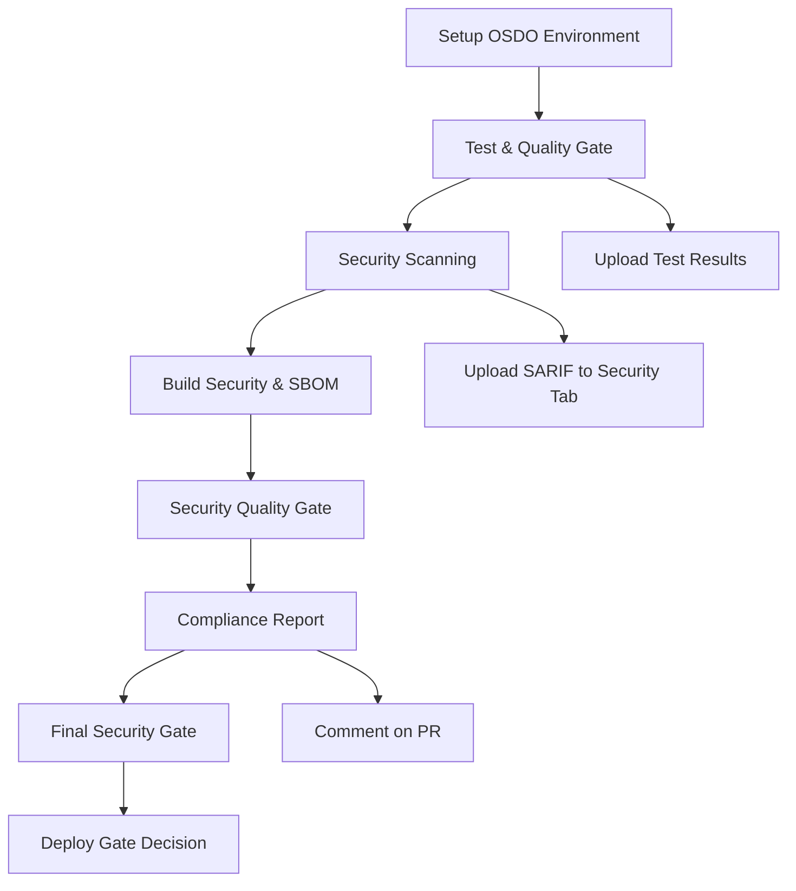

# 🛡️ OSDO Workflow Template

**Open Security DevOps (OSDO) Framework** - Template reutilizable para implementar pipelines de seguridad y compliance en proyectos de la organización.

## 🚀 Características Principales

- **🔧 Composite Actions Modulares**: Acciones reutilizables para cada fase del pipeline
- **📊 Reporting Completo**: Reportes de compliance en múltiples formatos
- **🔒 Seguridad Integral**: Análisis de dependencias, secretos, código estático y contenedores
- **🧪 Quality Gates**: Umbrales configurables para coverage y seguridad
- **📋 SARIF Compatible**: Integración nativa con GitHub Security tab
- **⚙️ Altamente Configurable**: Configuración flexible a través de inputs y archivos de config

## 🏗️ Arquitectura del Framework

```
.github/
├── workflows/
│   ├── osdo-framework.yml          # Workflow principal reutilizable
│   └── osdo-complete-workflow.yml  # Ejemplo de implementación
└── actions/
    ├── setup-osdo/                 # Setup del entorno OSDO (Node, Python, Java, Go, PHP)
    ├── test-quality/               # Tests y quality checks
    ├── security-scan/              # Orquestador de análisis de seguridad
    │   ├── sast/                   # Static Application Security Testing
    │   ├── sca/                    # Software Composition Analysis
    │   └── secrets/                # Detección de secretos
    ├── build-security/             # Build seguro y generación de SBOM
    ├── security-quality-gate/      # Evaluación de umbrales de seguridad
    └── compliance-report/          # Generación de reportes
```

## � Acciones Versionadas y Públicas

Todas las acciones están **versionadas con Semantic Versioning** y son **públicamente accesibles** desde cualquier repositorio.

### 🚀 Uso en Otros Proyectos

#### Opción 1: Framework Completo (Recomendado)

Usa el workflow reutilizable para un pipeline completo:

```yaml
jobs:
  osdo-pipeline:
    uses: opensecdevops/osdo-workflow-template/.github/workflows/osdo-framework.yml@main
    with:
      node-version: '22'
      python-version: '3.11'
      test-coverage-threshold: '80'
      enable-sca: true
      enable-sast: true
      enable-secrets: true
```

#### Opción 2: Acciones Individuales

Usa acciones específicas para control granular:

```yaml
- uses: opensecdevops/osdo-workflow-template/.github/actions/setup-osdo@setup-osdo/v1.0.0
- uses: opensecdevops/osdo-workflow-template/.github/actions/security-scan@security-scan/v1.0.0
- uses: opensecdevops/osdo-workflow-template/.github/actions/test-quality@test-quality/v1.0.0
```

---

## 📚 Documentación Completa

### 🚀 Inicio Rápido
- **[QUICK_START.md](docs/QUICK_START.md)** - Guía rápida de 2 minutos para empezar
- **[RESUMEN_EJECUTIVO.md](docs/RESUMEN_EJECUTIVO.md)** - Qué se implementó y por qué
- **[IMPLEMENTATION_SUMMARY.txt](IMPLEMENTATION_SUMMARY.txt)** - Resumen visual ASCII

### 📖 Documentación Principal
- **[USAGE_IN_OTHER_REPOS.md](docs/USAGE_IN_OTHER_REPOS.md)** - Cómo usar acciones en tus proyectos ⭐
- **[PUBLISHING_GUIDE.md](docs/PUBLISHING_GUIDE.md)** - Cómo publicar nuevas versiones ⭐
- **[FINAL_SETUP.md](docs/FINAL_SETUP.md)** - Pasos para hacer público el repositorio

### 📚 Referencia
- **[docs/INDEX.md](docs/INDEX.md)** - Índice completo de documentación
- **[NEXT_STEPS.md](NEXT_STEPS.md)** - Próximos pasos después de esta implementación
- **[CHANGELOG.md](CHANGELOG.md)** - Historial de cambios por versión

---

## 🔧 Uso Avanzado

### Opción 3: Usar como Template Repository

1. Usa este repositorio como template para crear nuevos proyectos
2. Personaliza el workflow `osdo-complete-workflow.yml` según tus necesidades

### Opción 4: Referenciar desde Otro Repositorio (Método Anterior)

Crea un workflow en tu proyecto que use el framework OSDO:

```yaml
name: 🛡️ Security & Compliance

on:
  push:
    branches: [ main, develop ]
  pull_request:
    branches: [ main ]

jobs:
  osdo-security:
    uses: opensecdevops/osdo-workflow-template/.github/workflows/osdo-framework.yml@main
    permissions:
      contents: read
      security-events: write
      actions: read
      pull-requests: write
    with:
      # Environment
      node-version: '20'
      python-version: '3.11'
      
      # Pipeline Control
      run-tests: true
      run-security-scan: true
      run-compliance-report: true
      
      # Thresholds
      test-coverage-threshold: '85'
      fail-on-high-security: true
      
      # Security Scans
      enable-sca: true
      enable-sast: true
      enable-secrets: true
      enable-container-scan: false
      
      # Build Security
      enable-build-security: true
      sbom-format: 'both'
      build-command: 'npm run build'

      # Quality Gate
      enable-quality-gate: true
      critical-threshold: '0'
      high-threshold: '5'
      secrets-threshold: '0'
```

## 📋 Configuración Avanzada

### Archivo de Configuración `.osdo/config.yml`

```yaml
# Personaliza los umbrales y configuraciones
test:
  coverage:
    minimum: 80

security:
  quality_gates:
    security_score:
      minimum: 90
      fail_on_high_severity: true

reporting:
  formats:
    - 'markdown'
    - 'html'
```

### Inputs Disponibles

| Input | Descripción | Default | Tipo |
|-------|-------------|---------|------|
| `node-version` | Versión de Node.js | `'22'` | string |
| `python-version` | Versión de Python | `'3.11'` | string |
| `java-version` | Versión de Java | `'17'` | string |
| `go-version` | Versión de Go | `'1.21'` | string |
| `php-version` | Versión de PHP | `'8.2'` | string |
| `test-coverage-threshold` | Umbral mínimo de cobertura | `'80'` | string |
| `enable-sca` | Habilitar Software Composition Analysis | `true` | boolean |
| `enable-sast` | Habilitar Static Application Security Testing | `true` | boolean |
| `enable-secrets` | Habilitar detección de secretos | `true` | boolean |
| `enable-container-scan` | Habilitar escaneo de contenedores | `false` | boolean |
| `fail-on-high-security` | Fallar en vulnerabilidades críticas | `true` | boolean |
| `report-format` | Formato del reporte | `'markdown'` | string |
| `enable-build-security` | Habilitar build seguro y generación de SBOM | `true` | boolean |
| `sbom-format` | Formato del SBOM (`json`/`xml`/`both`) | `'both'` | string |
| `build-command` | Comando para construir la aplicación | `'npm run build'` | string |
| `enable-quality-gate` | Habilitar Security Quality Gate | `true` | boolean |
| `critical-threshold` | Máximo permitido de vulnerabilidades críticas | `'0'` | string |
| `high-threshold` | Máximo permitido de vulnerabilidades altas | `'5'` | string |
| `secrets-threshold` | Máximo permitido de secretos detectados | `'0'` | string |

### Outputs Disponibles

| Output | Descripción |
|--------|-------------|
| `compliance-status` | Estado de compliance: `COMPLIANT`, `PARTIALLY_COMPLIANT`, `NON_COMPLIANT` |
| `security-score` | Puntuación de seguridad (0-100) |
| `test-coverage` | Porcentaje de cobertura de tests |
| `vulnerabilities-found` | Número total de vulnerabilidades encontradas |
| `quality-gate-status` | Estado del Quality Gate: `PASSED`, `WARNING`, `FAILED` |
| `build-verification` | Estado de verificación del build: `VERIFIED`, `WARNING`, `SKIPPED` |

## 🔍 Herramientas de Seguridad Incluidas

### Software Composition Analysis (SCA)
- **NPM Audit + audit-ci** - Vulnerabilidades en paquetes Node.js
- **Safety** - Vulnerabilidades en paquetes Python
- **OWASP Dependency-Check** - Análisis de dependencias Java (Maven/Gradle)
- **Govulncheck** - Herramienta oficial de Go para análisis de vulnerabilidades
- **Local PHP Security Checker** - Análisis de dependencias PHP (Composer)

### Detección de Secretos
- **TruffleHog** - Detección de secretos en código e historial de Git
- **Gitleaks** - Detección de credenciales filtradas y secretos expuestos

### Static Application Security Testing (SAST)
- **Semgrep** - Análisis de seguridad multi-lenguaje (JS, TS, Python, Java, Go, PHP)
- **Bandit** - Análisis de seguridad específico para Python
- **Gosec** - Análisis de seguridad para código Go
- **SpotBugs + Find-Sec-Bugs** - Análisis de seguridad para Java
- **PHPStan** - Análisis estático para PHP con enfoque en seguridad

### Análisis de Contenedores
- **Trivy** - Escaneo de vulnerabilidades en imágenes Docker
- **Hadolint** - Linting de Dockerfiles

## ⚡ Optimización de Performance

El framework implementa un **sistema de caché inteligente** que reduce significativamente los tiempos de ejecución:

### 📈 Mejora de Performance
- **70-75% reducción** en tiempos de ejecución de escáneres
- **5-8 minutos ahorrados** por ejecución completa del pipeline
- **Caché automático** para todas las herramientas de seguridad

### 🗂️ Cachés Implementados
- **SCA**: npm, pip, Maven, OWASP Dependency-Check DB, Go modules, Composer
- **SAST**: Semgrep rules, Go tools, Maven plugins, PHPStan incremental
- **Secrets**: Docker images para Gitleaks y TruffleHog
- **Builds**: Artefactos y dependencias de compilación

Ver documentación completa en [`docs/cache-optimization.md`](docs/cache-optimization.md)

## 📊 Reportes Generados

- **Compliance Report**: Reporte completo de estado de compliance
- **SARIF Files**: Archivos compatibles con GitHub Security tab
- **Test Coverage**: Reportes de cobertura de código
- **Security Scan Results**: Resultados detallados de análisis de seguridad
- **Build Security**: Manifiesto y verificación de integridad del build
- **SBOM**: Archivos `sbom.json` y `sbom.xml` (CycloneDX)

## 📌 Referencia Rápida de Acciones

| Acción | Versión | Descripción |
|--------|---------|-------------|
| `setup-osdo` | `@setup-osdo/v1.0.0` | Setup de entorno OSDO |
| `test-quality` | `@test-quality/v1.0.0` | Tests y quality checks |
| `security-scan` | `@security-scan/v1.0.0` | Análisis de seguridad integral |
| `build-security` | `@build-security/v1.0.0` | Build seguro y SBOM |
| `security-quality-gate` | `@security-quality-gate/v1.0.0` | Quality gate de seguridad |
| `compliance-report` | `@compliance-report/v1.0.0` | Generación de reportes |

---

## 🤖 Publicar Nuevas Versiones

Para publicar una nueva versión de una acción:

1. Ve a **Actions** → **🚀 Publish Release**
2. Click en **Run workflow**
3. Selecciona:
   - Acción a publicar
   - Versión (ej: 1.1.0)
   - ¿Breaking change? (si/no)
4. Click en **Run workflow**

El sistema automáticamente:
- ✅ Valida la versión
- ✅ Verifica que la action existe
- ✅ Crea el tag (`action-name/vX.Y.Z`)
- ✅ Publica GitHub Release
- ✅ Genera documentación de release

**Ejemplo**: Nueva feature en security-scan → versión 1.1.0 → disponible en `@security-scan/v1.1.0`

## 🔄 Pipeline Flow



## 🛠️ Desarrollo y Personalización

### Agregar Nuevas Herramientas de Seguridad

1. Modifica la action `security-scan/action.yml`
2. Agrega la configuración en `.osdo/config.yml`
3. Actualiza la documentación

### Personalizar Quality Gates

```yaml
# En tu workflow
with:
  test-coverage-threshold: '90'
  fail-on-high-security: false
```

### Agregar Nuevos Formatos de Reporte

Modifica la action `compliance-report/action.yml` para agregar formatos adicionales.

## 📚 Ejemplos de Uso

### Para Proyecto Node.js
```yaml
uses: opensecdevops/osdo-workflow-template/.github/workflows/osdo-framework.yml@main
with:
  node-version: '20'
  enable-container-scan: false
  test-coverage-threshold: '85'
```

### Para Proyecto Python
```yaml
uses: opensecdevops/osdo-workflow-template/.github/workflows/osdo-framework.yml@main
with:
  python-version: '3.11'
  node-version: 'false'
  enable-static-analysis: true
```

### Para Proyecto Java (Maven)
```yaml
uses: opensecdevops/osdo-workflow-template/.github/workflows/osdo-framework.yml@main
with:
  java-version: '17'
  node-version: 'false'
  build-command: 'mvn clean install'
  enable-sca: true
  enable-sast: true
  test-coverage-threshold: '80'
```

### Para Proyecto Go
```yaml
uses: opensecdevops/osdo-workflow-template/.github/workflows/osdo-framework.yml@main
with:
  go-version: '1.21'
  node-version: 'false'
  build-command: 'go build ./...'
  enable-sca: true
  enable-sast: true
  enable-secrets: true
```

### Para Proyecto PHP (Composer)
```yaml
uses: opensecdevops/osdo-workflow-template/.github/workflows/osdo-framework.yml@main
with:
  php-version: '8.2'
  node-version: 'false'
  build-command: 'composer install --no-dev --optimize-autoloader'
  enable-sca: true
  enable-sast: true
```

### Para Proyecto con Docker
```yaml
uses: opensecdevops/osdo-workflow-template/.github/workflows/osdo-framework.yml@main
with:
  enable-container-scan: true
  enable-sca: true
  enable-build-security: true
  sbom-format: 'both'
  enable-quality-gate: true
```

## 🤝 Contribución

1. Fork el repositorio
2. Crea una rama para tu feature
3. Implementa tus cambios siguiendo las mejores prácticas
4. Asegúrate de que todos los tests pasen
5. Abre un Pull Request

## 📄 Licencia

Este proyecto está licenciado bajo la [MIT License](LICENSE).

## 🆘 Soporte

Para soporte y preguntas:
- Abre un [Issue](https://github.com/opensecdevops/osdo-workflow-template/issues)
- Consulta la [Documentación](https://opensecdevops.com)
- Contacta al equipo de Security DevOps

---

**OSDO Framework** - Haciendo la seguridad accesible y estandarizada para todos