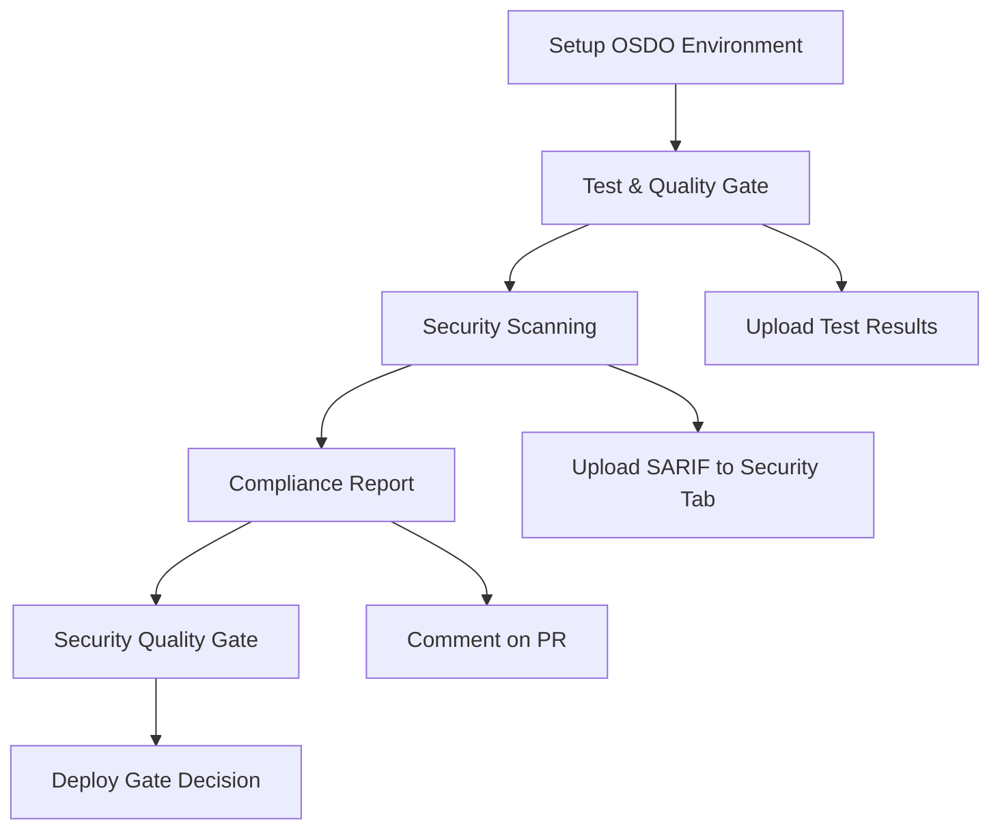

# 🛡️ OSDO Workflow Template

**Open Security DevOps (OSDO) Framework** - Template reutilizable para implementar pipelines de seguridad y compliance en proyectos de la organización.

## 🚀 Características Principales

- **🔧 Composite Actions Modulares**: Acciones reutilizables para cada fase del pipeline
- **📊 Reporting Completo**: Reportes de compliance en múltiples formatos
- **🔒 Seguridad Integral**: Análisis de dependencias, secretos, código estático y contenedores
- **🧪 Quality Gates**: Umbrales configurables para coverage y seguridad
- **📋 SARIF Compatible**: Integración nativa con GitHub Security tab
- **⚙️ Altamente Configurable**: Configuración flexible a través de inputs y archivos de config

## 🏗️ Arquitectura del Framework

```
.github/
├── workflows/
│   ├── osdo-framework.yml          # Workflow principal reutilizable
│   └── osdo-complete-workflow.yml  # Ejemplo de implementación
└── actions/
    ├── setup-osdo/                 # Setup del entorno OSDO
    ├── test-quality/               # Tests y quality checks
    ├── security-scan/              # Análisis de seguridad integral
    └── compliance-report/          # Generación de reportes
```

## 🔧 Uso en Otros Proyectos

### Opción 1: Usar como Template Repository

1. Usa este repositorio como template para crear nuevos proyectos
2. Personaliza el workflow `osdo-complete-workflow.yml` según tus necesidades

### Opción 2: Referenciar desde Otro Repositorio

Crea un workflow en tu proyecto que use el framework OSDO:

```yaml
name: 🛡️ Security & Compliance

on:
  push:
    branches: [ main, develop ]
  pull_request:
    branches: [ main ]

jobs:
  osdo-security:
    uses: opensecdevops/osdo-workflow-template/.github/workflows/osdo-framework.yml@main
    permissions:
      contents: read
      security-events: write
      actions: read
      pull-requests: write
    with:
      # Environment
      node-version: '20'
      python-version: '3.11'
      
      # Pipeline Control
      run-tests: true
      run-security-scan: true
      run-compliance-report: true
      
      # Thresholds
      test-coverage-threshold: '85'
      fail-on-high-security: true
      
      # Security Scans
      enable-dependency-scan: true
      enable-secrets-scan: true
      enable-static-analysis: true
      enable-container-scan: false
```

## 📋 Configuración Avanzada

### Archivo de Configuración `.osdo/config.yml`

```yaml
# Personaliza los umbrales y configuraciones
test:
  coverage:
    minimum: 80

security:
  quality_gates:
    security_score:
      minimum: 90
      fail_on_high_severity: true

reporting:
  formats:
    - 'markdown'
    - 'html'
```

### Inputs Disponibles

| Input | Descripción | Default | Tipo |
|-------|-------------|---------|------|
| `node-version` | Versión de Node.js | `'22'` | string |
| `python-version` | Versión de Python | `'3.11'` | string |
| `test-coverage-threshold` | Umbral mínimo de cobertura | `'80'` | string |
| `enable-dependency-scan` | Habilitar escaneo de dependencias | `true` | boolean |
| `enable-secrets-scan` | Habilitar detección de secretos | `true` | boolean |
| `enable-static-analysis` | Habilitar análisis estático | `true` | boolean |
| `enable-container-scan` | Habilitar escaneo de contenedores | `false` | boolean |
| `fail-on-high-security` | Fallar en vulnerabilidades críticas | `true` | boolean |
| `report-format` | Formato del reporte | `'markdown'` | string |

### Outputs Disponibles

| Output | Descripción |
|--------|-------------|
| `compliance-status` | Estado de compliance: `COMPLIANT`, `PARTIALLY_COMPLIANT`, `NON_COMPLIANT` |
| `security-score` | Puntuación de seguridad (0-100) |
| `test-coverage` | Porcentaje de cobertura de tests |
| `vulnerabilities-found` | Número total de vulnerabilidades encontradas |

## 🔍 Herramientas de Seguridad Incluidas

### Análisis de Dependencias
- **NPM Audit** - Vulnerabilidades en paquetes npm
- **Safety** - Vulnerabilidades en paquetes Python
- **Snyk** - Análisis avanzado de dependencias

### Detección de Secretos
- **TruffleHog** - Detección de secretos en código e historial
- **GitLeaks** - Detección de credenciales filtradas

### Análisis Estático (SAST)
- **Semgrep** - Análisis de seguridad multi-lenguaje
- **ESLint Security** - Reglas de seguridad para JavaScript/TypeScript
- **Bandit** - Análisis de seguridad para Python

### Análisis de Contenedores
- **Trivy** - Escaneo de vulnerabilidades en imágenes
- **Hadolint** - Linting de Dockerfiles

## 📊 Reportes Generados

- **Compliance Report**: Reporte completo de estado de compliance
- **SARIF Files**: Archivos compatibles con GitHub Security tab
- **Test Coverage**: Reportes de cobertura de código
- **Security Scan Results**: Resultados detallados de análisis de seguridad

## 🔄 Pipeline Flow



## 🛠️ Desarrollo y Personalización

### Agregar Nuevas Herramientas de Seguridad

1. Modifica la action `security-scan/action.yml`
2. Agrega la configuración en `.osdo/config.yml`
3. Actualiza la documentación

### Personalizar Quality Gates

```yaml
# En tu workflow
with:
  test-coverage-threshold: '90'
  fail-on-high-security: false
```

### Agregar Nuevos Formatos de Reporte

Modifica la action `compliance-report/action.yml` para agregar formatos adicionales.

## 📚 Ejemplos de Uso

### Para Proyecto Node.js
```yaml
uses: opensecdevops/osdo-workflow-template/.github/workflows/osdo-framework.yml@main
with:
  node-version: '20'
  enable-container-scan: false
  test-coverage-threshold: '85'
```

### Para Proyecto Python
```yaml
uses: opensecdevops/osdo-workflow-template/.github/workflows/osdo-framework.yml@main
with:
  python-version: '3.11'
  node-version: 'false'
  enable-static-analysis: true
```

### Para Proyecto con Docker
```yaml
uses: opensecdevops/osdo-workflow-template/.github/workflows/osdo-framework.yml@main
with:
  enable-container-scan: true
  enable-dependency-scan: true
```

## 🤝 Contribución

1. Fork el repositorio
2. Crea una rama para tu feature
3. Implementa tus cambios siguiendo las mejores prácticas
4. Asegúrate de que todos los tests pasen
5. Abre un Pull Request

## 📄 Licencia

Este proyecto está licenciado bajo la [MIT License](LICENSE).

## 🆘 Soporte

Para soporte y preguntas:
- Abre un [Issue](https://github.com/opensecdevops/osdo-workflow-template/issues)
- Consulta la [Documentación](https://github.com/opensecdevops/osdo-workflow-template/wiki)
- Contacta al equipo de Security DevOps

---

**OSDO Framework** - Haciendo la seguridad accesible y estandarizada para todos los proyectos de la organización. 🛡️